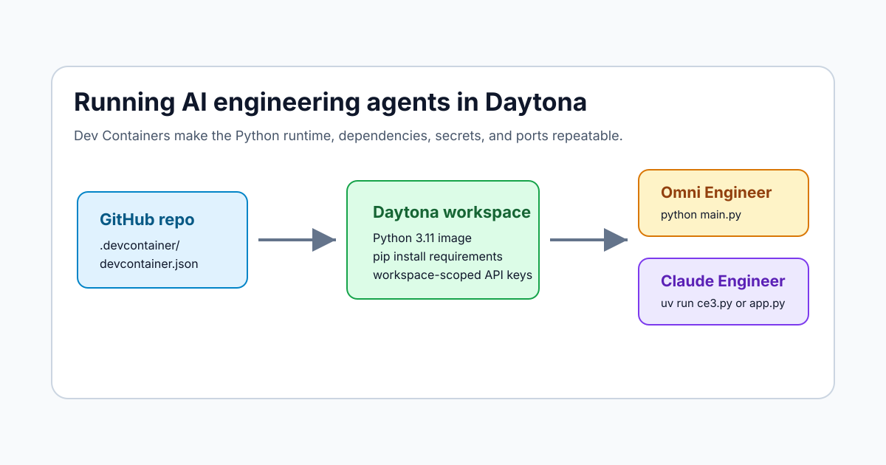

# Run AI Engineering Agents in Daytona

# Introduction

AI engineering agents are useful when they can inspect a repository, edit files,
run checks, and keep enough context to explain their work. They are also easy to
misconfigure. A local Python version, a missing API key, or a half-installed
dependency can turn a quick experiment into an environment debugging session.

[Daytona](https://www.daytona.io/docs/en/) is a good fit for this workflow
because it gives each agent a disposable, isolated workspace while keeping the
repository setup repeatable. The missing piece for many agent projects is a
checked-in [Dev Container](../definitions/20240819_definition_development%20container.md)
file. Once a repository has `.devcontainer/devcontainer.json`, Daytona and other
Dev Container-compatible tools know how to provision the same runtime every time.

This article shows how to run two Python AI engineering agents in Daytona:

- [Omni Engineer](https://github.com/Doriandarko/omni-engineer), an OpenRouter-powered console agent.
- [Claude Engineer](https://github.com/Doriandarko/claude-engineer), a Claude-powered CLI and Flask web interface.

I added upstream Dev Container pull requests for both repositories:

- Omni Engineer Dev Container: [Doriandarko/omni-engineer#30](https://github.com/Doriandarko/omni-engineer/pull/30)
- Claude Engineer Dev Container: [Doriandarko/claude-engineer#254](https://github.com/Doriandarko/claude-engineer/pull/254)

If those pull requests have not been merged yet, use the branch from each PR when creating the Daytona workspace.



## TL;DR

- Add `.devcontainer/devcontainer.json` to each AI engineering agent repository.
- Pass model API keys through Daytona environment variables instead of committing `.env` files.
- Run Omni Engineer with `python main.py`.
- Run Claude Engineer with `uv run ce3.py` for the CLI or `uv run app.py` for the web UI.
- Use separate Daytona workspaces for separate agents so their dependency state, generated files, and experiments stay isolated.

## What the Dev Containers Provide

The Dev Container files are intentionally small. They do not hide project behavior behind extra scripts, and they do not bake secrets into the image.

For Omni Engineer, the container does four things:

```json
{
  "name": "Omni Engineer",
  "image": "mcr.microsoft.com/devcontainers/python:3.11-bookworm",
  "postCreateCommand": "python -m pip install --user --upgrade pip && python -m pip install --user -r requirements.txt",
  "remoteEnv": {
    "OPENROUTER_API_KEY": "${localEnv:OPENROUTER_API_KEY}"
  }
}
```

That gives the workspace Python 3.11, installs the repository's `requirements.txt`, and makes `OPENROUTER_API_KEY` available if you provide it to Daytona.

Claude Engineer needs one extra piece because its README uses `uv run`:

```json
{
  "name": "Claude Engineer",
  "image": "mcr.microsoft.com/devcontainers/python:3.11-bookworm",
  "postCreateCommand": "python -m pip install --user --upgrade pip uv && python -m pip install --user -r requirements.txt",
  "forwardPorts": [5000],
  "remoteEnv": {
    "ANTHROPIC_API_KEY": "${localEnv:ANTHROPIC_API_KEY}",
    "E2B_API_KEY": "${localEnv:E2B_API_KEY}"
  }
}
```

The forwarded port is for the Flask web interface. The `E2B_API_KEY` value is optional for basic chat, but Claude Engineer includes an E2B code execution tool, so the variable is declared up front.

## Prerequisites

Before creating the workspaces, make sure you have:

- A Daytona account and access to the Daytona dashboard or CLI.
- GitHub access to the repositories or forks you want to open.
- An OpenRouter API key for Omni Engineer.
- An Anthropic API key for Claude Engineer.
- An E2B API key if you plan to use Claude Engineer's code execution tool.

You should also be comfortable with basic [Git](../definitions/20240819_definition_git.md), [Python](../definitions/20240820_defintion_python.md), and [environment variables](../definitions/20241126_definition_environment_variables.md).

## Create the Omni Engineer Workspace

Open Daytona and create a new workspace from the Omni Engineer repository:

```text
https://github.com/Doriandarko/omni-engineer
```

If the Dev Container PR is still pending, use the contributor branch from [PR #30](https://github.com/Doriandarko/omni-engineer/pull/30) instead of the default branch.

Add this environment variable in the workspace configuration:

```bash
OPENROUTER_API_KEY=your_openrouter_key
```

When Daytona starts the workspace, it reads `.devcontainer/devcontainer.json`, pulls the Python 3.11 Dev Container image, and runs the dependency installation command. After the workspace is ready, open a terminal and verify the project imports:

```bash
python -m compileall main.py
```

Then start Omni Engineer:

```bash
python main.py
```

Use `/model` to inspect the active model and `/change_model` if you want to switch to a different OpenRouter model. A useful first prompt is:

```text
Inspect this repository and summarize the commands I should use to validate a small code change.
```

That prompt tests whether the agent can read the repository and answer from local context before you ask it to edit anything.

## Create the Claude Engineer Workspace

Create a second Daytona workspace from the Claude Engineer repository:

```text
https://github.com/Doriandarko/claude-engineer
```

If the Dev Container PR is still pending, use the contributor branch from [PR #254](https://github.com/Doriandarko/claude-engineer/pull/254).

Add the required environment variables:

```bash
ANTHROPIC_API_KEY=your_anthropic_key
E2B_API_KEY=your_e2b_key
```

After Daytona finishes building the Dev Container, validate the main entry points:

```bash
python -m compileall ce3.py app.py tools
```

Start the CLI:

```bash
uv run ce3.py
```

Or start the web interface:

```bash
uv run app.py
```

The Dev Container forwards port `5000`, so use Daytona's preview URL for that port to open the Flask UI. If you only want a terminal workflow, the CLI is enough.

## A Practical Agent Workflow

The safest way to use these agents is to give each one a narrow task and keep Git as the source of truth. A simple workflow looks like this:

1. Create a fresh branch inside the Daytona workspace.
2. Ask the agent to inspect the relevant files before editing.
3. Ask for a short implementation plan.
4. Let the agent make the change.
5. Run the project's validation commands yourself.
6. Review `git diff` before committing.

For Omni Engineer, you can start with a repository navigation task:

```text
Find the files that control command parsing and explain how /model is handled.
Do not edit files yet.
```

For Claude Engineer, you can use either the CLI or web UI for a similar task:

```text
Inspect the tool loading flow and identify one low-risk test that would cover it.
Do not write code until I confirm the plan.
```

This pattern matters because AI agents can move quickly, but a Daytona workspace should still be treated as a real development environment. The isolation protects your local machine, while Git review protects the repository.

## Why Separate Workspaces Help

Running both agents in one environment is possible, but it creates avoidable coupling. Omni Engineer and Claude Engineer use different model providers, different API keys, and different entry points. Separate Daytona workspaces give you:

| Concern | Separate workspace benefit |
| --- | --- |
| Dependencies | Each repository installs only its own Python packages. |
| Secrets | OpenRouter, Anthropic, and E2B keys can be scoped to the workspace that needs them. |
| Port forwarding | Claude Engineer can own port `5000` without conflicting with other tools. |
| Experiment cleanup | Archive or delete one workspace without touching the other. |
| Reviewability | Each workspace has a smaller Git diff and a clearer task history. |

This is especially useful when evaluating an [AI engineering agent](../definitions/20260514_definition_ai_engineering_agent.md). You can compare how each tool handles the same repository task without carrying over hidden state.

## Troubleshooting

If Omni Engineer exits immediately, check the OpenRouter key:

```bash
printenv OPENROUTER_API_KEY
```

If Claude Engineer fails during startup, check the Anthropic key:

```bash
printenv ANTHROPIC_API_KEY
```

If the Claude Engineer web UI is running but you cannot open it, confirm that the app is listening on port `5000`:

```bash
uv run app.py
```

Then open the Daytona preview URL for port `5000`. The Dev Container declares this port so compatible tools can surface it automatically.

If dependency installation fails during workspace creation, rerun the install command manually from the repository root:

```bash
python -m pip install --user --upgrade pip uv
python -m pip install --user -r requirements.txt
```

For Omni Engineer, omit `uv`:

```bash
python -m pip install --user --upgrade pip
python -m pip install --user -r requirements.txt
```

## Conclusion

Dev Containers turn AI engineering agent repositories into reproducible Daytona workspaces. Instead of documenting a long manual setup, each repository declares the Python runtime, dependencies, editor defaults, forwarded ports, and expected environment variables in one file.

For Omni Engineer, that means a quick OpenRouter-powered console workspace. For
Claude Engineer, it means a Claude-powered CLI or web UI with port forwarding
already declared. In both cases, Daytona provides the isolated environment, while
the Dev Container keeps setup consistent for every contributor who opens the
repository.

## References

- [Daytona documentation](https://www.daytona.io/docs/en/)
- [Daytona CLI reference](https://www.daytona.io/docs/en/tools/cli/)
- [GitHub introduction to Dev Containers](https://docs.github.com/en/codespaces/setting-up-your-project-for-codespaces/adding-a-dev-container-configuration/introduction-to-dev-containers)
- [Omni Engineer Dev Container PR](https://github.com/Doriandarko/omni-engineer/pull/30)
- [Claude Engineer Dev Container PR](https://github.com/Doriandarko/claude-engineer/pull/254)
